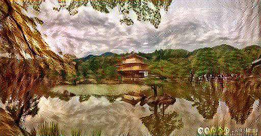

# Neural-Style-Transfer
Neural Style Transfer

### <u>1. Libraries used: </u>
    - Tensorflow (Code Compatible with 2.00 alpha & 1.1x version)
    - Scikit-learn
    - Pandas
    - Numpy
    - Matplotlib
    - Pillow
    - Function tools
  
### <u>2. Basic Approach: </u>
    Points of importance: 
        1. The VGG19 model trained on ImageNet is used in order to save time on learning image features.
        2. Style & Content Layers are selected from the VGG19 Model and are used in computing Style loss & Content Loss values respectively
        3. The formula for content loss is the Euclidean Distance between the output and content images
        4. The formula for style loss is based upon the comparison of their Gram matrices

### <u>3. Changes from Source Article: </u>
    The major changes from the source(see below) include:
        - Additional visualizations for every 10 epoch
        - Compatibility with tf 2.00
        - Additional Content Layers 
        - Changes to helper functions

### <u>4. References used: </u>
    - https://medium.com/tensorflow/neural-style-transfer-creating-art-with-deep-learning-using-tf-keras-and-eager-execution-7d541ac31398
    -https://github.com/vinayak19th/Neural-Style-Transfer

# **Outputs:**

## <u>Content Image</u>
> 

## <u>Style Image</u>
> 

## <u>Output Image</u>
> 
